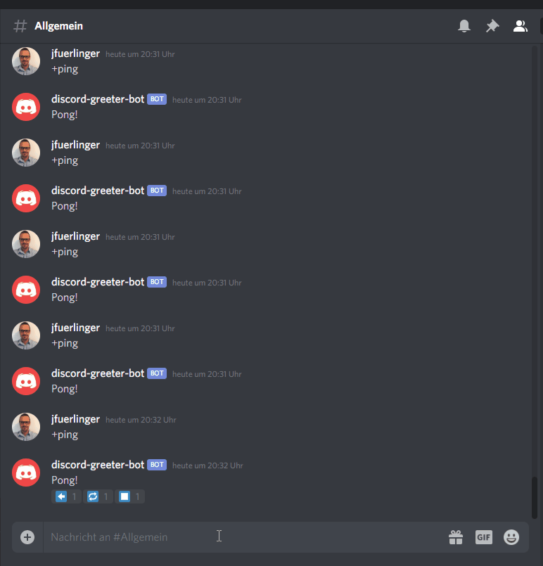

# Serta Bot

A bot to motivate the studies ...

## How-To

```
# Get the .env file from github.com/jfuerlinger and locate it in the root directory

npm install
npm start
```

## Description

### Overview



### Features

1. Manage the health points of a student
2. Print some statistcs
3. Be super fancy

